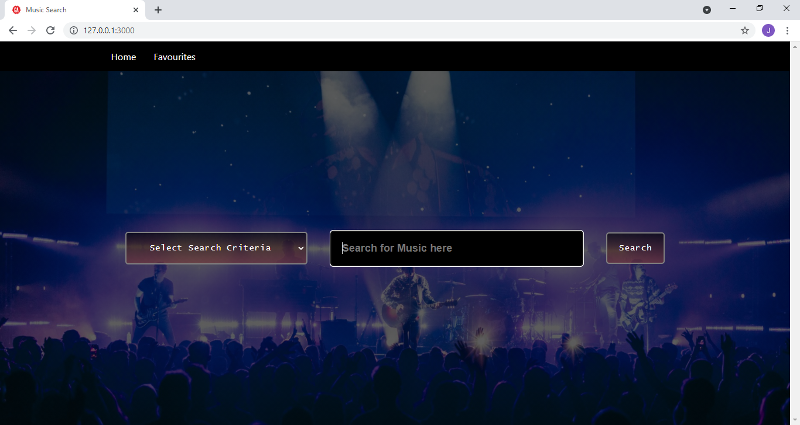
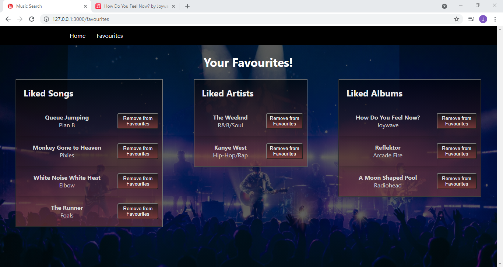
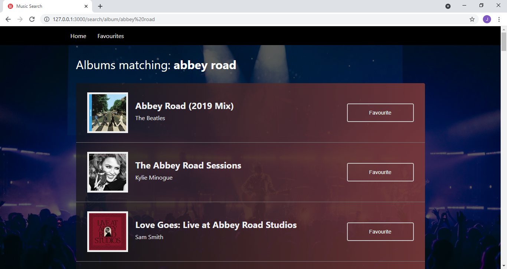
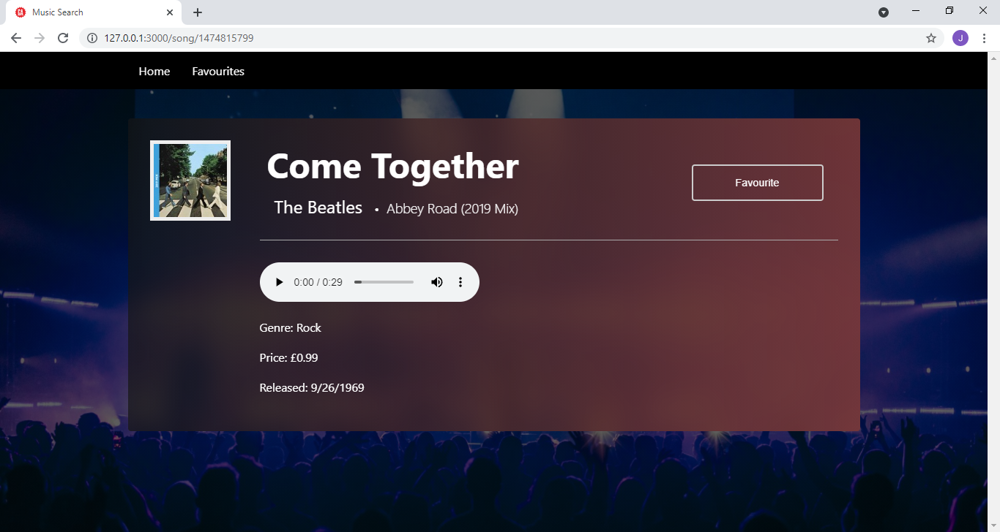
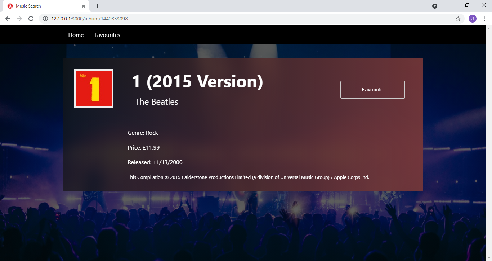

#  GA Project 2

## Technical Requirements

Your app must:

- [x] **Consume a public API** – this could be anything but it must make sense for your project.
  - [iTunes Search API](https://developer.apple.com/library/archive/documentation/AudioVideo/Conceptual/iTuneSearchAPI/index.html)
- [x] **Be built with React and React Router** - with several different pages. A good model for this is an index page to show a list of items, and the show page, for a single item. But it's up to you.
- [x] **Include logic to filter or search or sort the data in some way**.
  - User can search for songs, albums, or artists from the homepage
- [x] **Use Local Storage to store data on the frontend** - it is up to you what you store.
  - Stores user's favourite songs, albums, and artists
- [x] **Use at least one new library/package of your own choosing** - this requirement encourages you to make use of the npm ecosystem to add functionality to your project. It can be something very small!
  - Uses `react-spinner` when loading data

---

## Necessary Deliverables

- [x] A **git repository hosted on Github**, with frequent commits dating back to the _very beginning_ of the project
  - [https://git.generalassemb.ly/jaymayer/project-2](https://git.generalassemb.ly/jaymayer/project-2)
- [x] **A `readme.md` file** with:
  - [x] A paragraph or two about the **general approach you took**
  - [x] Brief **instructions** for how to install dependencies and run your project
  - [x] Descriptions of any **unsolved problems** or **major hurdles** your team had to overcome
  - [x] A screenshot of your working app

---

# General Approach

- We set out to create an app that allows the user to search for songs, albums, or artists. They should then be able to 'favourite' the search results, so that they appear in the user's 'Favourites' list. This list should persist between page reloads

# Instructions

- Install project dependencies from the root directory

  ```
  npm i
  ```

- Run a development server
  ```
  npm run start
  ```

# Unsolved Problems / Hurdles

- (Solved) We attempted to show an album's song list on the album page, however the `http://itunes.apple.com/lookup` endpoint (unlike `http://itunes.apple.com/search`) doesn't send back the correct CORS headers to be used on the front-end
- (Solved) Lifecycle of a component controlled by `react-router`
  - Clicking on a `<Link>` doesn't unmount a component if the same component is present on both routes
  - Caused some interesting bugs with stale state
    - (Solved) The favourite song list can overwrite the favourite album list when clicking a `<Link>` to an album page from a song pageLink
    - (Solved) The homepage input/errors clear when you click the `Home` link and the home page is refreshed
- (Solved) Remove favourites button
  - Making sure that the favourites page interacts correctly with other pages
  - Devising a consisten approach to favourites that works well across all pages
- (Solved) Getting `bulma` to work modularly
  - We only wanted to use `bulma` styles in a few places, but it was getting in the way of styling other components
  - The solution was to uninstall `bulma` and use only custom styles

# Screenshots






